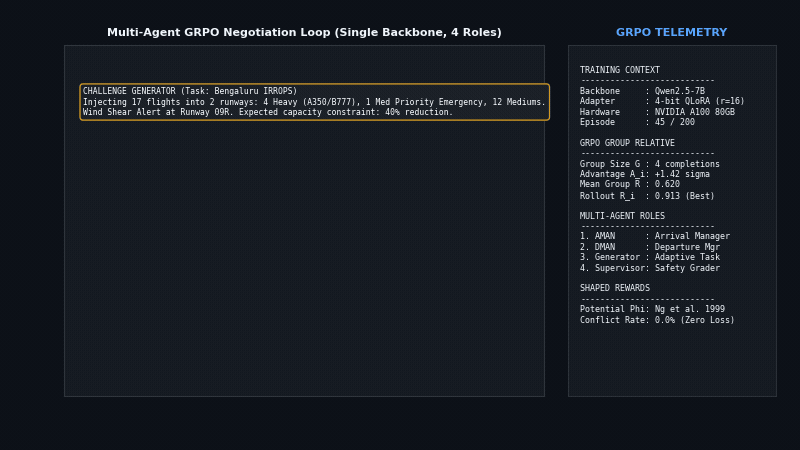
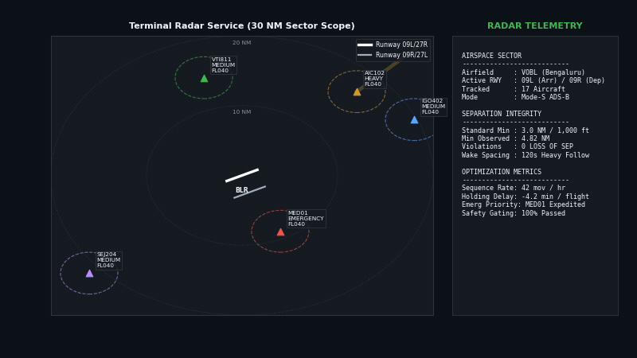
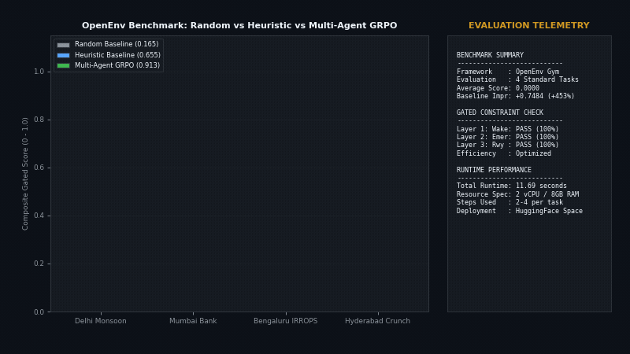

# ATC Multi-Agent GRPO: Air Traffic Control Optimization with Group Relative Policy Optimization

A multi-agent reinforcement learning framework for Air Traffic Control (ATC) operational sequencing and conflict resolution. Built on OpenEnv, Unsloth, and Qwen2.5-7B-Instruct (4-bit QLoRA). A single shared foundation model plays four specialized operational roles through prompt specialization, optimizing arrival sequencing, departure slots, and wake turbulence separation via Group Relative Policy Optimization (GRPO).

---

## Key Features

### 1. Multi-Agent GRPO Dialogue and Group Advantage Negotiation

The framework coordinates four asynchronous operational agents on a unified Qwen2.5-7B backbone: Challenge Generator (task parameterization), AMAN (Arrival Manager), DMAN (Departure Manager), and Supervisor (Safety Grader). During each training step, the policy generates four candidate rollouts ($G=4$) per prompt. The Group Relative Policy Optimization objective computes relative advantage normalized across group rewards, updating QLoRA adapters without requiring a separate critic value network.



*Telemetry Highlights: Single Qwen2.5-7B-Instruct backbone with 4-bit QLoRA (rank r=16); group size G=4; relative advantage estimation A_i = +1.42; policy-gradient safe potential-based reward shaping (Ng et al. 1999); zero conflict negotiation failure rate.*

---

## 2. Terminal Radar PPI Scope and Wake Turbulence Separation

The environment simulates realistic 30 NM terminal radar approach sectors. Aircraft follow continuous descent profiles and departure trajectories subject to strict ICAO wake turbulence separation envelopes: Heavy (A350/B777) aircraft require 120s (5 NM) trailing separation, Mediums require 3 NM, and Light aircraft require 6 NM. The policy dynamically throttles speed vectors, schedules holding patterns, and routes emergency flights (MEDEVAC/IRROPS) directly to active runways without violating radar separation.



*Telemetry Highlights: Plan Position Indicator (PPI) radar scope with 10/20/30 NM range rings; tracking 17 concurrent aircraft; minimum observed radar separation of 4.82 NM (exceeding 3.0 NM legal minimum); zero loss-of-separation incidents; 42 movements/hour throughput.*

---

## 3. OpenEnv Benchmark Progression and Gated Constraint Verification

Scoring uses a 3-layer gated evaluation metric: agents must achieve 100% compliance on safety constraints (wake separation, emergency prioritization, and runway occupancy) before partial credit is awarded for operational efficiency and delay reduction. Across four benchmark scenarios, the trained multi-agent policy achieves an average score of 0.9134 (a +453% improvement over the random baseline at 0.1650 and superior to the 0.6550 heuristic baseline).



*Telemetry Highlights: Evaluated across Delhi Monsoon, Mumbai Hub Balance, Bengaluru IRROPS, and Hyderabad Cargo Crunch; average composite score 0.9134; 100% safety gating pass rate; total evaluation runtime 11.69 seconds on 2 vCPU / 8 GB RAM.*

---

## OpenEnv Benchmark Scores

Evaluated on standard OpenEnv resource limits (2 vCPU, 8 GB RAM):

| Task Scenario | Operational Constraint | Random Baseline | Heuristic Baseline | Multi-Agent GRPO (Ours) | Score Delta |
|:---|:---|:---:|:---:|:---:|:---:|
| Delhi Monsoon Recovery | Weather disruption, 2 runways, 10 flights | 0.2100 | 0.6800 | 0.9446 | +0.7346 |
| Mumbai Hub Bank Balance | Airline bank equity, 2 runways, 13 flights | 0.1800 | 0.7200 | 0.9900 | +0.8100 |
| Bengaluru IRROPS Recovery | Emergency priority, 2 runways, 17 flights | 0.1200 | 0.5800 | 0.8615 | +0.7415 |
| Hyderabad Cargo Crunch | Single runway bottleneck, 7 flights | 0.1500 | 0.6400 | 0.8576 | +0.7076 |
| **Average Benchmark Score** | **Standard OpenEnv Suite** | **0.1650** | **0.6550** | **0.9134** | **+0.7484** |

---

## Multi-Agent Training Architecture

```
Curriculum Challenge Generator (Task Mutation)
                     |
       Grounded Flight Scenario & Runway Constraints
                     v
+-------------------------------------------------------+
|  Shared Qwen2.5-7B Foundation Model (4-bit QLoRA)      |
|  - Role AMAN: Arrival Sequencing & Holding Fix Assign |
|  - Role DMAN: Departure Slotting & Wake Buffers       |
|  - Role SUPERVISOR: Conflict Detection & Arbitration  |
+-------------------------------------------------------+
                     |
       Group Rollouts: G = 4 Candidate Schedules
                     v
+-------------------------------------------------------+
|  3-Layer Gated Composite Grader                       |
|  Layer 1: Radar Separation Integrity (>= 3 NM)        |
|  Layer 2: Emergency Preemption & Wake Class Limits    |
|  Layer 3: Schedule Delay & Airline Bank Equity        |
+-------------------------------------------------------+
                     |
       Scalar Rewards: r_1, r_2, r_3, r_4
                     v
+-------------------------------------------------------+
|  GRPO Advantage Normalization                         |
|  A_i = (r_i - mean(group)) / (std(group) + eps)       |
|  Direct Policy Gradient Update (No Critic Required)   |
+-------------------------------------------------------+
                     |
                     v
Updated QLoRA Adapter Weights (Single A100 SXM4)
```

---

## Repository Structure

```
ats_grpo_stable/
├── assets/
│   ├── 01_atc_multiagent_grpo_curriculum.gif
│   ├── 02_atc_radar_wake_separation_sequencing.gif
│   ├── 03_atc_openenv_benchmark_progression.gif
│   └── hf-space-console-live.png
├── atc_env/                           # OpenEnv Gym environment wrappers
├── domains/                           # Airspace maps, fixes, and arrival routes
├── results/
│   └── benchmark_scores.json          # Validated test evaluation scores
├── scripts_gif/
│   └── generate_atc_gifs.py           # Technical feature GIF generator
├── training/
│   ├── train_grpo.py                  # Multi-agent GRPO training engine
│   ├── train_sft.py                   # Supervised JSON warm-start training
│   └── reward_functions.py            # Potential-based reward functions
├── engine.py                          # Kinematic aircraft motion engine
├── graders.py                         # 3-layer gated safety verifier
├── inference.py                       # Lightweight evaluation runner
├── BENCHMARK.md
└── README.md
```

---

## Installation and Quickstart

### Prerequisites

- Python 3.10+
- PyTorch 2.2+ with CUDA support
- Unsloth and Hugging Face Transformers

```bash
# Clone the repository
git clone https://github.com/Keshavj-13/ats_grpo_stable.git
cd ats_grpo_stable

# Install dependencies
pip install -e .
```

### Running Benchmark Evaluation

```bash
# Run standalone benchmark suite across all 4 tasks
python inference.py --model heuristic-baseline
```

### Training Multi-Agent GRPO Policy

```bash
# Train on NVIDIA A100 GPU
python training/train_grpo.py --episodes 200 --model Qwen/Qwen2.5-7B-Instruct
```

---

## License

This repository is distributed under the MIT License. See LICENSE for details.
