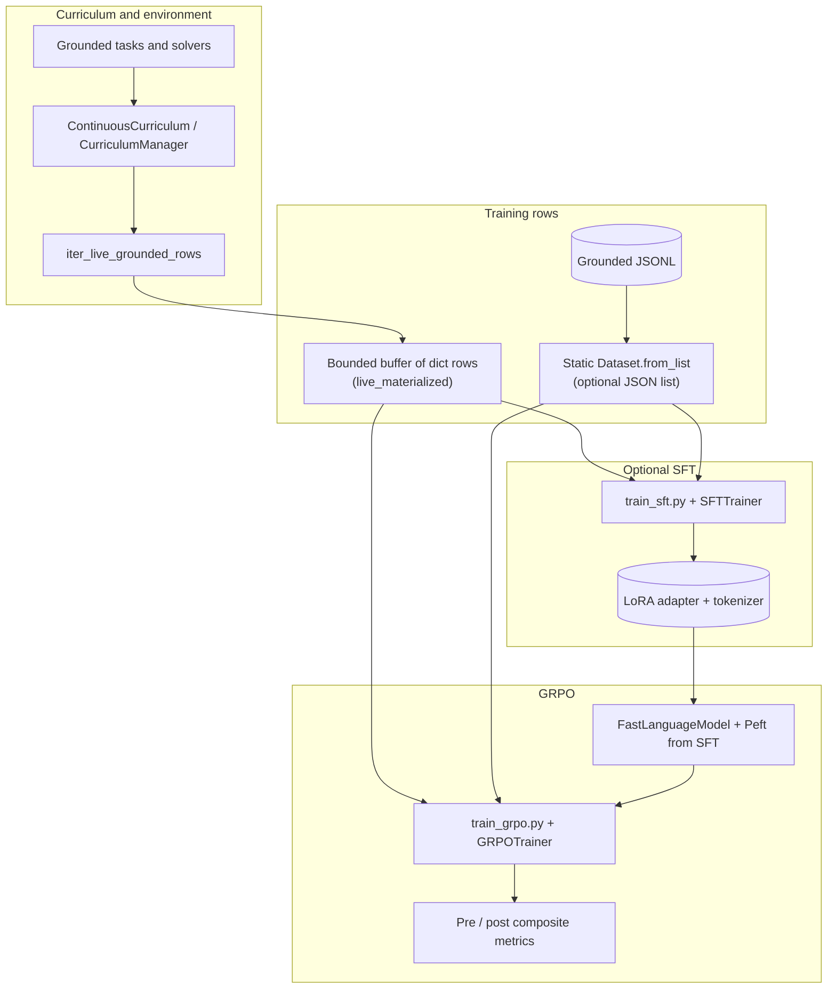
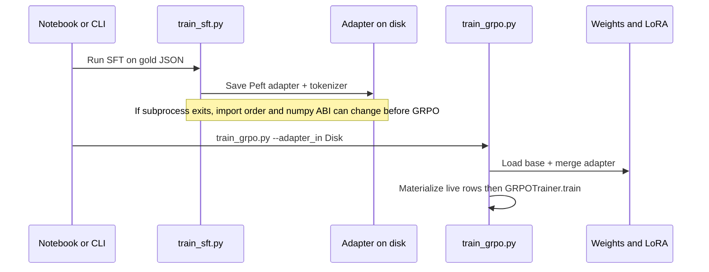
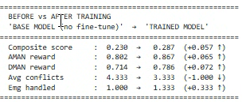
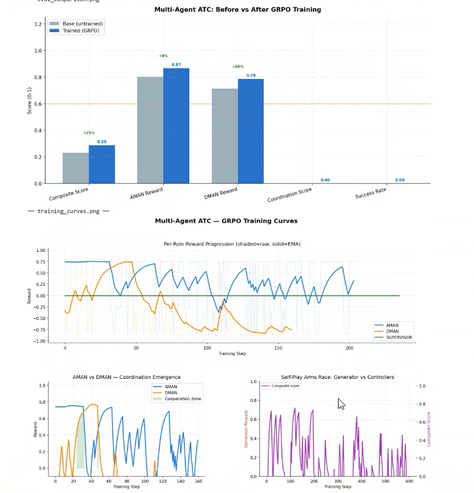

# ATC multi-agent GRPO + SFT (stable snapshot)

This repository is a **frozen, working snapshot** of the Air Traffic Control (ATC) multi-agent reinforcement learning stack: **grounded curriculum → optional JSON SFT → GRPO** with **Unsloth** QLoRA on a shared backbone (e.g. Qwen2.5-7B-Instruct). It matches the code that completed end-to-end training on an **NVIDIA A100 80GB** in April 2026.

If you maintain a faster-moving tree elsewhere, treat this copy as a **reference implementation** and reproducibility anchor.

---

## What you get

| Layer | Role |
|--------|------|
| **Grounded tasks** | Deterministic or curriculum-driven scenarios (`tasks_grounded.py`, `curriculum_grounded.py`). |
| **Live curriculum** | `continuous_curriculum.py` + `live_curriculum.py` produce training rows with chat-style prompts and metadata. |
| **SFT (optional)** | `training/train_sft.py` + `training/sft_data.py`: supervised JSON on gold traces before RL. |
| **GRPO** | `training/train_grpo.py`: group-relative policy optimization with per-role rewards (`training/reward_functions.py`). |

---

## Architecture (data and training flow)



**Why `live_materialized`?** Streaming HF `IterableDataset` batches still contained **string leaves** inside nested chat dicts. Accelerate’s `find_batch_size` walks the batch tree and **crashes** on raw `str`. The stable fix is to **materialize** a finite prefix from the same live iterator, then `Dataset.from_list`, which matches the static path TRL/Unsloth expect.



---

## Results (example A100 run)

### Terminal summary: before vs after (post-training eval)



On this run, **post-training scripted eval** showed higher composite and role rewards and fewer average conflicts than the **base adapter** checkpoint measured right after loading SFT weights (see training log section below for why in-run reward telemetry can look different).

### Training curves and multi-panel analysis



The charts include a short **cooperation window** (early steps where AMAN and DMAN rewards spike together) and later **volatility** typical of multi-agent self-play. **Coordination score** and **success rate** stayed at zero in that visualization slice: either the metric definitions were not triggered by that eval configuration, or the bar chart is reporting placeholders—worth verifying in `training/plot_rewards.py` / eval hooks if you need those bars non-zero.

---

## Example training log (what “healthy” looks like)

### SFT

- **360** supervised examples, **400** optimizer steps, batch 2 × grad accum 4 → effective 8.
- Loss fell from ~**3.9** toward ~**0.07** over ~**9.8 minutes**.
- Unsloth restored `added_tokens_decoder` metadata into `tokenizer_config.json` at checkpoints (normal for extended vocab / chat templates).

### GRPO (after SFT adapter load)

- `Live grounded (materialized n=2912, max_steps=75, …)` — buffer sized from steps × batch × generations (+ cap).
- **75** GRPO steps on **2912** rows, batch 8, **4** completions per prompt for group-relative advantages.
- `[LIVE]` lines stream **per-step** role rewards, parse rates, diversity, and correlation diagnostics.

### Important discrepancy to understand

The log ends with both:

- **`=== TRAINING REWARD SUMMARY ===`** — means over **training batches** (e.g. composite mean **0.037**, last quartile negative for DMAN).
- **`BEFORE vs AFTER TRAINING`** table — from **separate short eval rollouts** after loading base-then-adapter vs final adapter.

Those can diverge: training rewards aggregate **on-policy sampling noise**, **GRPO group baselines**, and **different prompts** than the small fixed eval episodes. The table is still useful as a **sanity check** that the adapter did not collapse on a held-out style smoke eval.

---

## Warnings you can explain to teammates

| Message | Meaning |
|---------|---------|
| **Tokenizer PAD/BOS/EOS differ from model config** | Hugging Face aligned `model.config` / `generation_config` to the tokenizer (e.g. `bos_token_id: None`). Usually harmless for causal LMs; watch only if generation prepends wrong tokens. |
| **Padding-free training … use flash_attention_2** | Unsloth enables padding-free paths; FA2 is the best-tested backend. If FA2 is broken, Unsloth may fall back to xFormers—slightly different behavior, still often fine. |
| **Cannot patch MLP layers … LoRA not enabled or bias** | Qwen bias / no LoRA on MLP blocks: informational; QKV/O projection patching still applied. |
| **`warmup_ratio` deprecated** | Prefer explicit `warmup_steps` in new configs. |
| **`use_return_dict` deprecated** | Rename to `return_dict` when you touch call sites. |
| **`steps_per_generation` / `generation_batch_size` not in grpo_trainer** | Unsloth version skew vs TRL; shims in `train_grpo.py` paper over API drift. |

---

## Failure mode from the same session: NumPy 2 vs OpenCV (vLLM import chain)

After SFT finished, starting GRPO in a **new process** sometimes triggered:

```text
import unsloth → fix_vllm_guided_decoding_params → vllm → … → cv2 → ImportError: compiled using NumPy 1.x cannot be run in NumPy 2.2.6
```

**Mitigations (pick one):**

1. Pin **`numpy<2`** in the training image / venv (fastest).
2. Upgrade **opencv** / **opencv-python-headless** to a wheel built against NumPy 2.
3. Avoid importing **vLLM** on the training path if your build does not need it (harder—Unsloth pulls it).

Document this in your Dockerfile or `pyproject.toml` so CI and notebooks do not regress.

---

## Quick start (conceptual)

```bash
# From repo root, PYTHONPATH must include the repo (see HF_GPU_TRAINING.md in tree).
export PYTHONPATH="$(pwd):${PYTHONPATH}"

# 1) Optional SFT on gold JSON
python training/train_sft.py --help

# 2) GRPO with grounded curriculum and warm-started adapter
python training/train_grpo.py --adapter_in /path/to/sft-output --grounded_curriculum ...
```

Use `training/train_jupyter.ipynb` for an orchestrated **SFT then GRPO** smoke with subprocess calls; align `output_dir` and `--adapter_in` paths with your container (`/tmp/atc/outputs/...` in the reference logs).

---

## Repository layout (high level)

- `training/train_grpo.py` — main GRPO entry, materialized live dataset, compatibility shims.
- `training/train_sft.py` — SFT stage.
- `training/sft_data.py` — gold row construction.
- `training/live_curriculum.py`, `training/continuous_curriculum.py` — row generation and state.
- `tasks_grounded.py`, `training/curriculum_grounded.py` — task definitions and grounding.
- `multi_agent/` — roles, environment wiring, generator/supervisor paths used in rewards and eval.
- `tests/` — pytest contracts; run `pytest -q` after edits.

---

## Relationship to the upstream `ats` project

This directory was created as a **standalone git root** so you can publish or tag it without the parent repo’s unrelated history. To refresh from your main tree:

```bash
rsync -a --delete \
  --exclude='.git' --exclude='wandb' --exclude='outputs' \
  /path/to/ats/ /path/to/ats-grpo-stable/
```

Then commit intentionally.

---

## License and upstream

Respect the licenses of **Unsloth**, **Transformers**, **TRL**, **vLLM**, **Qwen**, and any vendored reference code under `scripts/fetch_openenv_hackathon_refs.sh` (not shipped in this snapshot by default).

---

*Snapshot generated from the working tree; training screenshots and log interpretation added for documentation.*
